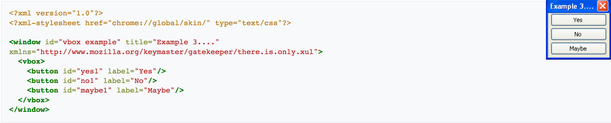
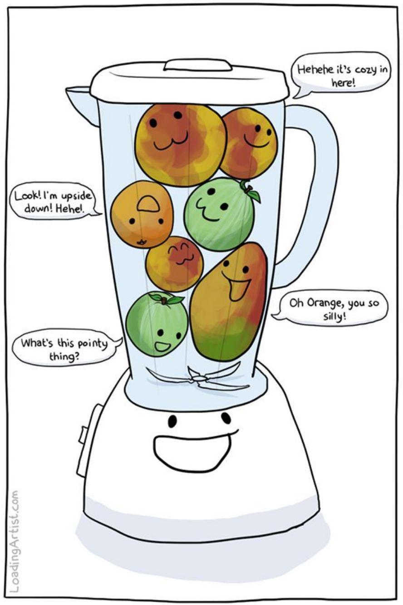
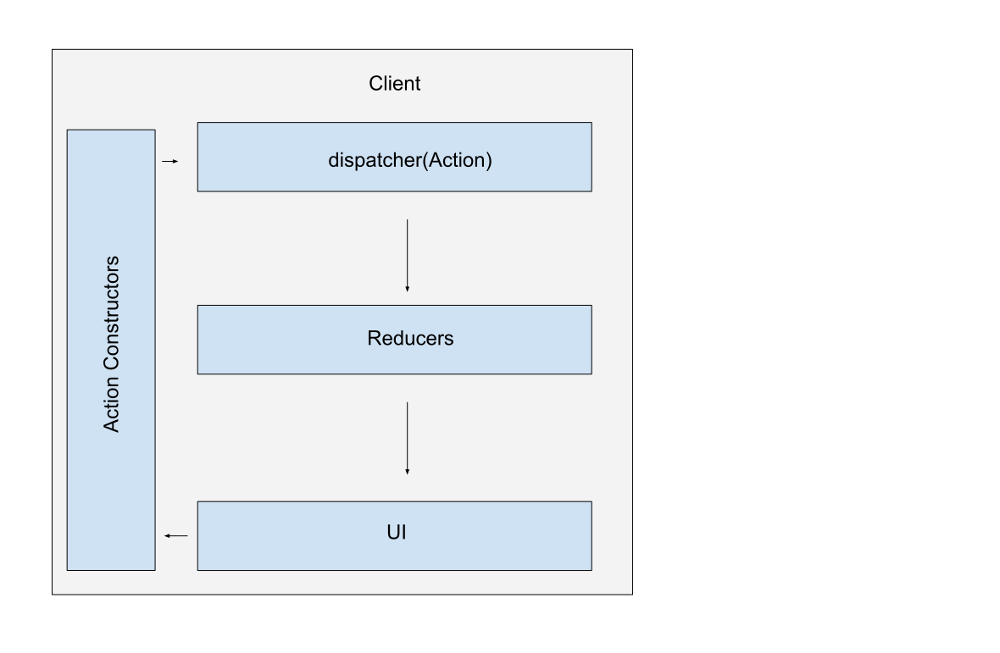
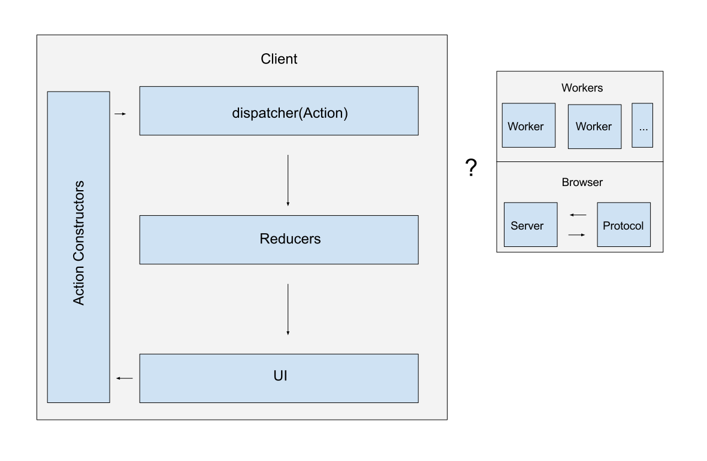
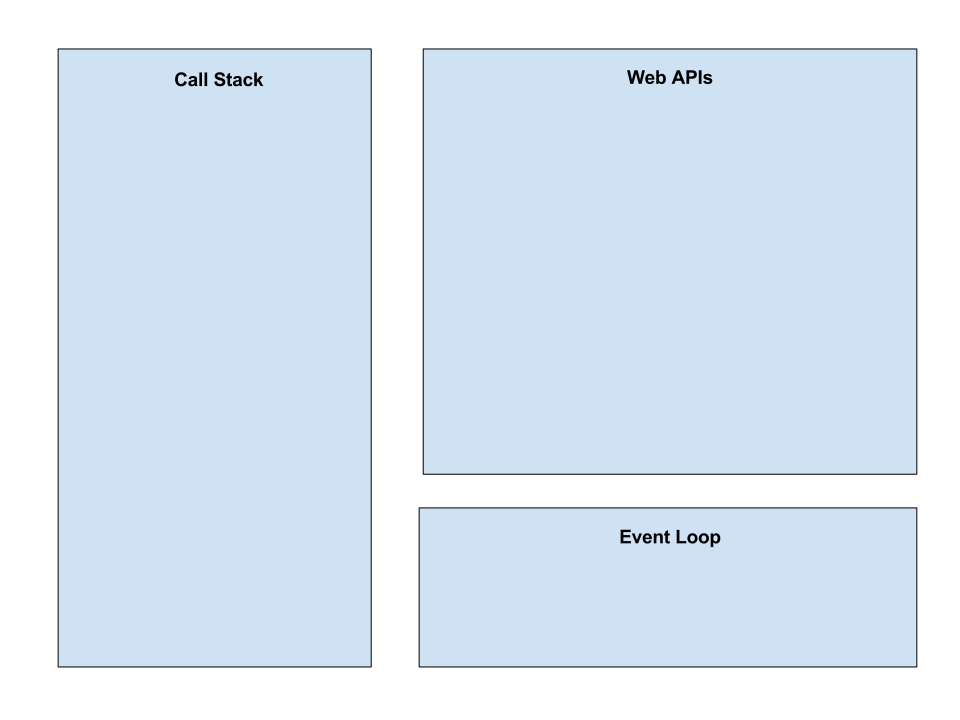
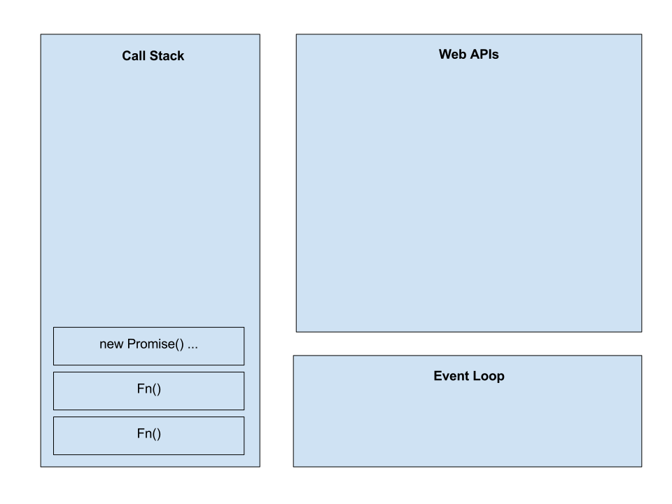
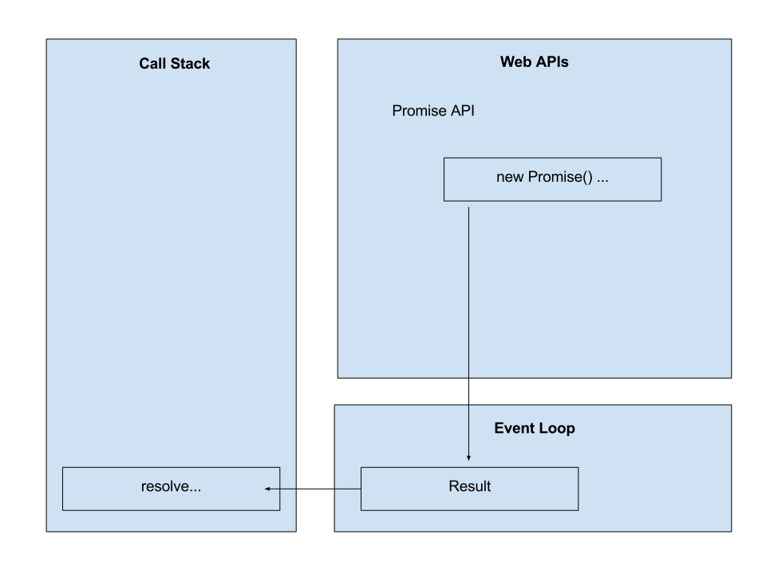
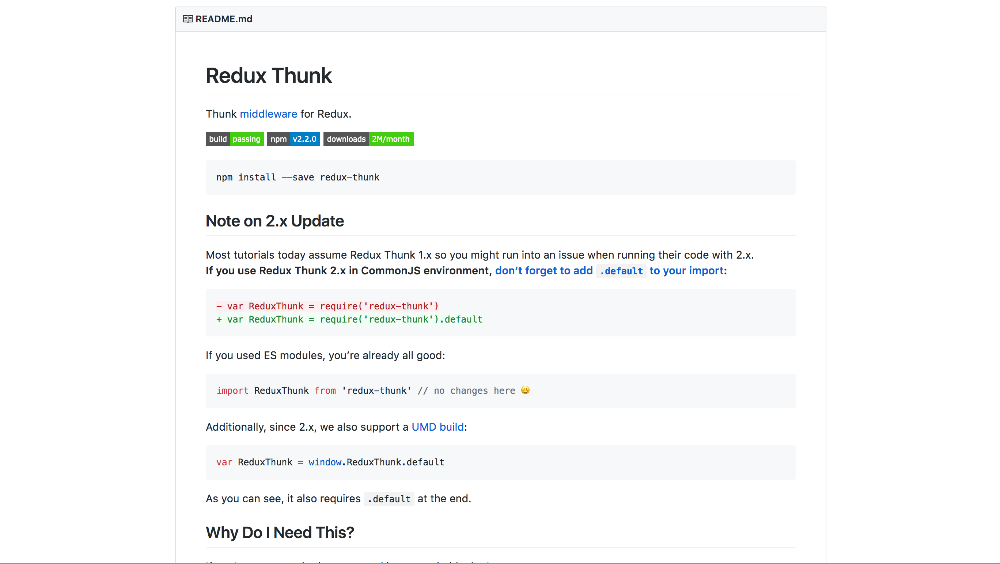
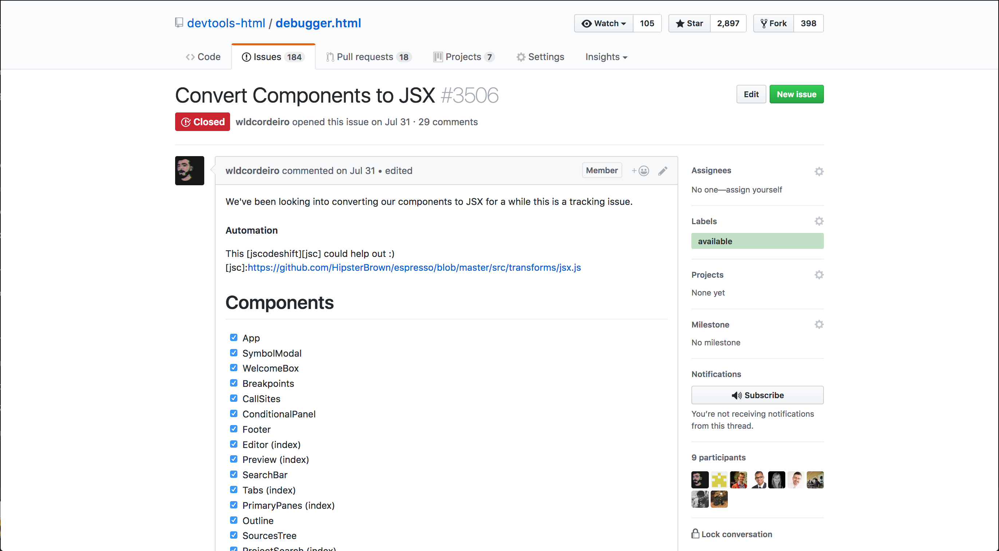
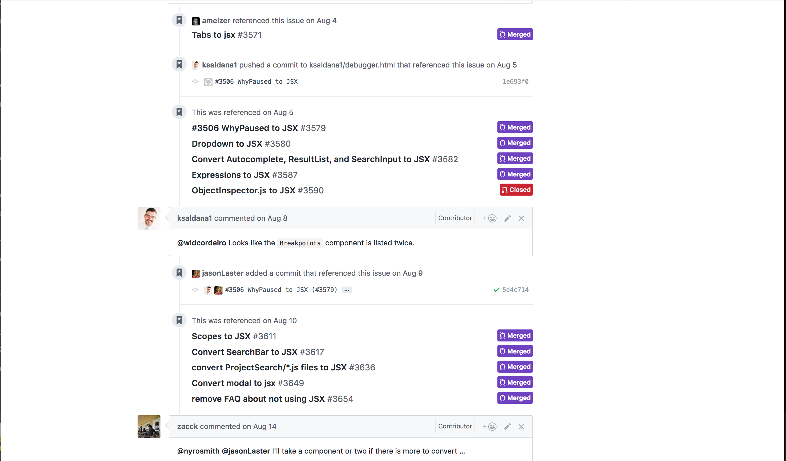

# Side-Effects
### Results may vary

Yulia Startsev

@ioctapteb

---

<!-- .slide: data-background="./images/debugger.png" -->

---

<!-- .slide: data-background="./images/debugger-debuggee.png" -->

# ⬅ Target
<!-- .element: class="fragment" data-fragment-index="1" -->

Note:
* a debugger is a program that runs along side a program during the development
* it helps narrow down problems within the debuggee
* it doesn't see everything, only what a compiler tells it. this is the roll of the emitter

---

<!-- .slide: data-background="./images/debugger-2.png" -->

---

<!-- .slide: data-background="./images/debugger-3.png" -->

---

<!-- .slide: data-background="./images/debugger-4.png" -->

---

Javascript:
```javascript
function foo(x) {
  return x.a;
}
```

Emitter:
<!-- .element: class="fragment" data-fragment-index="1" -->

```c++
main:
00000: getarg 0
00003: dup
00004: callprop "a"
00009: swap
00010: call-ignores-rv
00013: pop
00014: retrval
```
<!-- .element: class="fragment" data-fragment-index="1" -->

Note:
* is informed where the interpreter is in the execution, as the program is running
* is capable of pausing the program
* knows what has happened before this point (callstack)
* allows the user to select pause points

---

### once...
## There was only XUL


<!-- .element: style="border: none;" -->
https://en.wikipedia.org/wiki/XUL
<!-- .element: style="font-size: 15px" -->

Note:
* are a user interface for choosing where to stop
* are persisted between runs
* this is a question of UI

---

### The javascript blender



Note:
* a lot of different ideas are coming from different disciplines

---


---

### Flux


<!-- .element: style="border: none;" -->


Note:
* central store
* store is updated via actions and reducers
* actions should send "what happened"
* reducers should combine the existing state with the new data

---

### Action Creator
```javascript
function basicAction() {
  return ({ dispatch }) => {
    dispatch({ type: "BASIC_ACTION", message: "hi" });
}
```

---

### Reducer

```javascript
function update(state, action) {
  // action = { type: "BASIC_ACTION", message: "hi" }
  switch (action.type) {
    case "BASIC_ACTION":
      return { message: action.message };
    default:
      return state;
  }
}
```

---

#### Async Data Flow


<!-- .element: style="border: none; width: 700px" -->

---

#### Async Data Flow


<!-- .element: style="border: none; width: 700px" -->

---

## Two strategies

 
<h4 style="width: 50%; float: left">Redux-Thunk</h4>
<!-- .element: class="fragment" data-fragment-index="1" -->
<h4 style="width: 50%; float: right">Redux-Saga</h4>
<!-- .element: class="fragment" data-fragment-index="2" -->

---

## Interlude:
### understanding async methods in javascript


* promise
<!-- .element: class="fragment" data-fragment-index="1" -->
* async / await
<!-- .element: class="fragment" data-fragment-index="2" -->
* generators
<!-- .element: class="fragment" data-fragment-index="3" -->

---

### simple promise

```javascript
const asyncedFn = new Promise((resolve, reject) => {
  // ...
  if (success) {
    resolve(response);
  } else {
    reject("Error!");
  }
});
```

Note:
* promises are a web api
* has three states: pending, done, and error

---

### Using the promise

```javascript
asyncFn
  .then(result => {
    return result;
  })
  .catch(err => {
    throw new Error(err);
  });

```

---

### Using the promise

```javascript
const initialState = doSomething1();

let globalVar;
asyncFn
  .then(result => globalVar = result)

doSomething2(global);
```

---

### Promise and callstack


<!-- .element: style="border: none; width: 600px" -->

---

### Promise and callstack


<!-- .element: style="border: none; width: 600px" -->

---

### Promise and callstack


<!-- .element: style="border: none; width: 600px" -->

---

### Promise and callstack


<!-- .element: style="border: none; width: 600px" -->

---

### Promise and callstack


<!-- .element: style="border: none; width: 600px" -->

---

### Promise and callstack


<!-- .element: style="border: none; width: 600px" -->

---

### Philip Roberts: What the heck is the event loop anyway?
[](https://www.youtube.com/watch?v=8aGhZQkoFbQ)

---

### Promises as async / await

```javascript
async function something() {
  const initialState = doSomething1();
  const result = await asyncFn(initialState);
  const finalState = doSomething2(result);
  return finalState;
}
```

---

### understanding generators

```javascript
function* beuysGenerator() {
  yield "ja ja ja";
  yield "ne ne ne";
}

const jaNein = beuysGenerator();

jaNein.next() // { value: "ja ja ja", done: false }
jaNein.next() // { value: "ne ne ne", done: false }
jaNein.next() // { value: undefined, done: true }
```

Note:
* are data consumers, producers, and coroutines
* generators are the underlying logic behind async-await
* generators create an object with a next() method
* `yield` keyword is used to express a "pause" before the `next()` call
* the saga middle ware takes care of calling .next() when an async call is completed

---

>>Generators are functions that can be paused and resumed (think cooperative multitasking or coroutines), which enables a variety of applications.
>
http://exploringjs.com/es6/ch_generators.html

---


### Bodil Stokke - The Miracle of Generators
[](https://www.youtube.com/watch?v=SPgPhKLE1wg)

---

### Redux-Thunk


<!-- .element: style="border: none;" -->

Note:
* compiler theory -- comes from "to have already thought"
* first formalized in 1961 in a paper by Peter Ingermann in reference to the ALGOL 60 programming
  language
* subroutines to compute values if the arguments can be arbitrary expressions rather than constants

---

#### Thunk dataflow


<!-- .element: style="border: none; width: 700px" -->

Note:
* React implementation of this is Promise based
* wraps the dispatcher

---

### Action creator

```javascript
function basicAction() {
  return ({ dispatch }) => {
    dispatch({
      type: "BASIC_ACTION",
      message: "hi",
      [PROMISE]: async funtion() {
        return await asyncOperation(); // { message: `hi ${user}` }
      }
    });
}
```

---

### Reducer

```javascript
function update(state, action) {
  switch (action.type) {
    case "BASIC_ACTION":
      if (action.status === "start") {
        // { status: "start", message: "hi", ... }
        return { message: action.message };
      }
      if (action.status === "done") {
        // { status: "done", message: "hi", value: { message: "hi user" }, ... }
        return { message: action.value.message };
      }
      return state;
    default:
      return state;
  }
}
```

---

### Reducer: another way to look at it

```javascript
function update(state, action) {
  switch (action.type) {
    case "BASIC_ACTION":
      switch (action.status) {
        case "start":
          // { status: "start", message: "hi", ... }
          return { message: action.message };
        case "done":
          // { status: "done", message: "hi", value: { message: "hi user" }, ... }
          return { message: action.value.message };
        default:
          return state;
    default:
      return state;
  }
}
```

---

### Redux-Saga


<!-- .element: style="border: none;" -->

Note:
* comes from the database community -- Hector Garcia-Molina & Kenneth Salem
* each step has potential to roll back or roll forward
* generator based
* listens to actions, and dispatches it's own actions when it is ready
* highly useful for scheduling

---

>> A long life transaction is a saga if it can be written as a sequence of transactions that can be interleaved with other transactions
>
-- Hector Garcia-Molina & Kenneth Salem

---

#### Saga data-flow


<!-- .element: style="border: none; width: 700px" -->

---

### Action Creator
```javascript
function basicAction() {
  return ({ dispatch }) => {
    dispatch({ type: "BASIC_ACTION", message: "hi" });
}
```

---

### Saga
```javascript
function* watchBasicAction() {
  yield takeEvery('BASIC_ACTION', basicSaga)
}

function* basicSaga() {
  const message = await asyncOperation(); // { message: `hi ${user}` }
  yield put({ type: "SUCCESSFUL_ACTION", message });
}
```

---

### Thunk wrapped dispatch

```javascript
dispatch({
  type: "BASIC_ACTION",
  message: "hi",
  [PROMISE]: async funtion() {
    return await asyncOperation(); // { message: `hi ${user}` }
  }
});
```

---

### Reducer

```javascript
function update(state, action) {
  switch (action.type) {
    case "BASIC_ACTION":
      // action = { message: "hi", ... }
      return { message: action.message };
    case "SUCCESSFUL_ACTION":
      // action = { message: "hi user", ... }
      return { message: action.message };
    default:
      return state;
  }
}
```

---

## The problem

### Spooky action at a distance

# 👻

Note:
* Complex interactions between the client, server and workers
* Eager updates to keep the ui running smooth
* Rolling back on errors


---

## Consider the Bug

# 🐞

opening a loaded source causes the source to blink

---

```
server event "new source"
|-> new source
   |-> dispatch "ADD_SOURCE"
   |-> maybe add source map
   |   |-> load sourceMap
   |   |-> add original sources
   |-> maybe select source
   |   |-> load Source Text
   |   |-> re-evaluate breakpoints
   |   |-> dispatch addBreakpoints
   |-> maybe add breakpoints
       |-> load Source Text
       |-> dispatch selectSource
```

---

## Load source text
* is used in two places
<!-- .element: class="fragment" data-fragment-index="1" -->
* is costly
<!-- .element: class="fragment" data-fragment-index="2" -->

---

## The Source of the Bug

```javascript
function newSource(source) {
  return async ({ dispatch, getState }) => {
    dispatch({ type: "ADD_SOURCE", source });
    selectedSource(getState(), dispatch, source);
    await checkBreakpoints(getState(), dispatch, source);
    dispatch(loadSourceMap(source));
  };
}
```

---

```javascript
function selectSource(sourceId}) {
  return ({ dispatch, getState }) => {
    // ...
    if (source.isSelected) {
      await dispatch(loadSourceText(source));
      // ...
    }
  };
}
```

```javascript
async function checkBreakpoints(state, dispatch, source) {
  // ...
  if (breakpoints.length) {
    await dispatch(loadSourceText(source));
    // ...
  }
}
```

---

### Solution 1
#### using Thunks

```javascript
function newSource(source) {
  return async ({ dispatch, getState }) => {
    dispatch({ type: "ADD_SOURCE", source });
    await selectedSource(getState(), dispatch, source);
    checkBreakpoints(getState(), dispatch, source);
    dispatch(loadSourceMap(source)); // an async operation
  };
}
```

---

### Solution 2
#### using Sagas

```javascript
function* watchNewSource() {
  yield takeEvery('NEW_SOURCE', newSource)
}

function* newSource(source) {
  yield put({ type: "ADD_SOURCE", source });
  const proc1 = yield fork(loadSourceMap, source));
  const proc2 = yield fork(selectSource, source));
  const proc3 = yield fork(checkBreakpoints, source));
  yield join([ proc1, proc2, proc3 ]);
  yield put({ type: "SOURCE_ADDED, source });
}
```

---

### blocking
<!-- .element: style="float: left; width: 50%; align: center" -->
### non-blocking
<!-- .element: style="float: right; width: 50%; align: center" -->

```javascript
take
take.maybe
put.resolve
call
all
join
cancel
actionChannel
```
<!-- .element: style="float: left; width: 45%" -->


```javascript
takeEvery
put
fork
spawn
```
<!-- .element: style="float: right; width: 45%" -->

---

### Saga: blocking put

```javascript
// thunk
await dispatch(loadSourceText(source));

// saga
yield put.resolve({ type: "LOAD_SOURCE_TEXT", source });
```

Note:
* put is not blocking

---

### Saga: channels
```javascript
yield takeEvery('BASIC_ACTION', basicSaga)

// vs

const requestChan = yield actionChannel('LOAD_SOURCE_TEXT')
```

---

```javascript
function* watchLoadSourceText() {
  const requestChan = yield actionChannel('LOAD_SOURCE_TEXT')
  while (true) {
    const { payload: { source } } = yield take(requestChan)
    if (source.text) {
      yield source;
    } else {
      yield call(loadSourceText, source)
    }
  }
}
```

---

```javascript
function* loadSourceText(source) {
  const data = yield call(loadSourceTextContents, source);
  yield put.resolve({ type: "SOURCE_TEXT_AVAILABLE", source, ...data });
  yield call(setSymbols, source.id);
  yield call(setEmptyLines, source.id);
}
```

---

### Doing more with sagas
```javascript
function* watchLoadSourceText() {
  const requestChan = yield actionChannel('LOAD_SOURCE_TEXT')
  while (true) {
    const { payload: { source } } = yield take(requestChan)
    if (source.text) {
      yield source;
    } else {
      // lets do something else here...
    }
  }
}
```

---

### roll forward on an error
```javascript
// retry and error handling
function* loadSourceTextRepeat(source) {
  for(let i = 0; i < 5; i++) {
    try {
      yield call(loadSourceText, source)
    } catch (err) {
      yield call(delay, 1000); // try again in a bit
    }
  }
  yield put({ type: "LOAD_TEXT_ERROR", source });
}
```

---

### do something else entirely
```javascript
// retry and error handling
function* streamSource(source) {
  try {
    yield call(loadSourceText, source)
  } catch (err) {
    yield put({ type: "DELETE_SOURCE", source }); //re-enter the queue at the end
  }
}
```

---

### thunk reducer
```javascript
function update(state, action) {
  switch (action.type) {
    case "LOAD_SOURCE_TEXT":
      if (status === "error") {
        // ... we would have to handle rollback here
      }
      return state;

    default:
      return state;
  }
}
```

---

### saga reducers
```javascript
function update(state, action) {
  switch (action.type) {
    case "LOAD_SOURCE_TEXT":
      // ...

    case "SOURCE_TEXT_AVAILABLE":
      // ...

    case "SOURCE_ERROR":
      // ...

    case "DELETE_SOURCE":
      // ...

    case "RESET_TO_LOADING":
      // ...

    default:
      return state;
  }
}
```

---

## Observations

* simple promises are sufficient in most cases
<!-- .element: class="fragment" data-fragment-index="1" -->
* thunks are useful if you need eager updates and error handling on the reducer
<!-- .element: class="fragment" data-fragment-index="2" -->
* sagas are useful when working with complex scheduling tasks
<!-- .element: class="fragment" data-fragment-index="3" -->

Note:
* much of the code is the same
* sagas become truely useful when you have complex scheduling
* thunks are useful for simple applications that do not need this amount of control
* sagas are more declaritive than thunks; you will need to comment less
* sagas have a learning curve, meaning any new contributor to your project will have a period of
  time to ramp up

---

## Criticisms of both Thunks and Sagas

* they are too powerfull and do too much
<!-- .element: class="fragment" data-fragment-index="1" -->
* the same can be achieved with simple promises
<!-- .element: class="fragment" data-fragment-index="2" -->
* thunks lead to duplicate async logic
<!-- .element: class="fragment" data-fragment-index="3" -->
* sagas and generators are difficult to understand
<!-- .element: class="fragment" data-fragment-index="3" -->

---

## Positive aspects of Thunks

* easy to start using
<!-- .element: class="fragment" data-fragment-index="1" -->
* work for a large number of cases
<!-- .element: class="fragment" data-fragment-index="2" -->
* good for eager updates when an action reflects an api call
<!-- .element: class="fragment" data-fragment-index="3" -->

---

## Positive aspects of Sagas

* excellent for testing
<!-- .element: class="fragment" data-fragment-index="1" -->
* handle complex scheduling very well
<!-- .element: class="fragment" data-fragment-index="2" -->
* allows fine grained control over what happens in the system
<!-- .element: class="fragment" data-fragment-index="3" -->

---

## What did we do in the end?

We are sticking with thunks... for the time being
<!-- .element: class="fragment" data-fragment-index="1" -->

Reasons:
<!-- .element: class="fragment" data-fragment-index="2" -->
* while difficult to maintain, the community is familiar with them
<!-- .element: class="fragment" data-fragment-index="3" -->
* it is not yet the right time to do a large scale refactoring
<!-- .element: class="fragment" data-fragment-index="4" -->

---

### Getting the community ready for a change

* discussed with core community members
<!-- .element: class="fragment" data-fragment-index="2" -->
* received feedback from the maintainers of redux-saga
<!-- .element: class="fragment" data-fragment-index="3" -->
* experimented on a small scale
<!-- .element: class="fragment" data-fragment-index="4" -->

---

### Going forward as a community


<!-- .element: style="border: none; width: 700px" -->

---

### Going forward as a community


<!-- .element: style="border: none; width: 700px" -->

---

## Thank you!

http://github.com/devtools-html

@ioctaptceb
