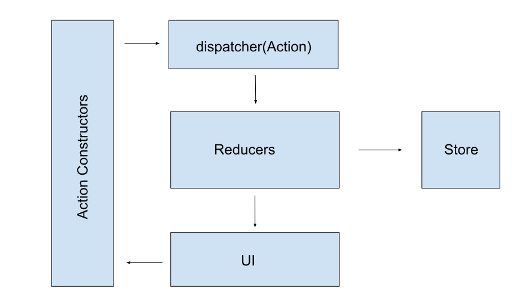
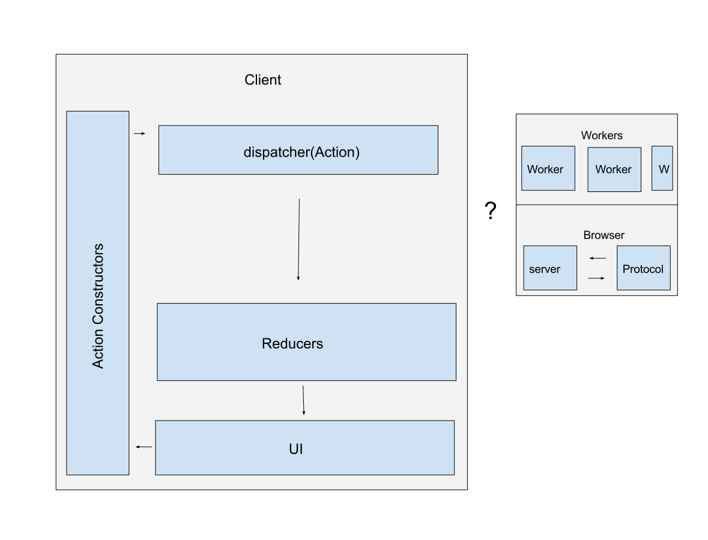
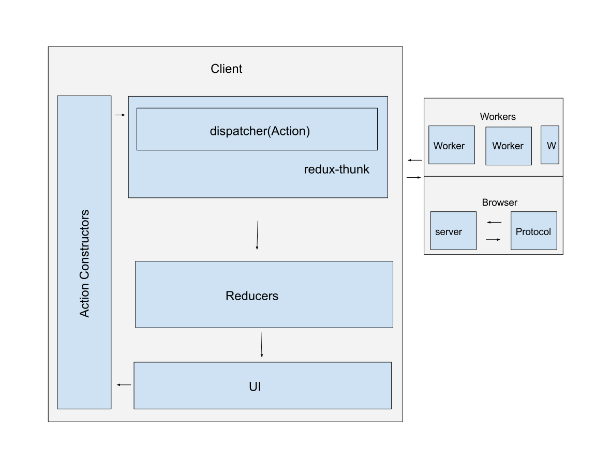
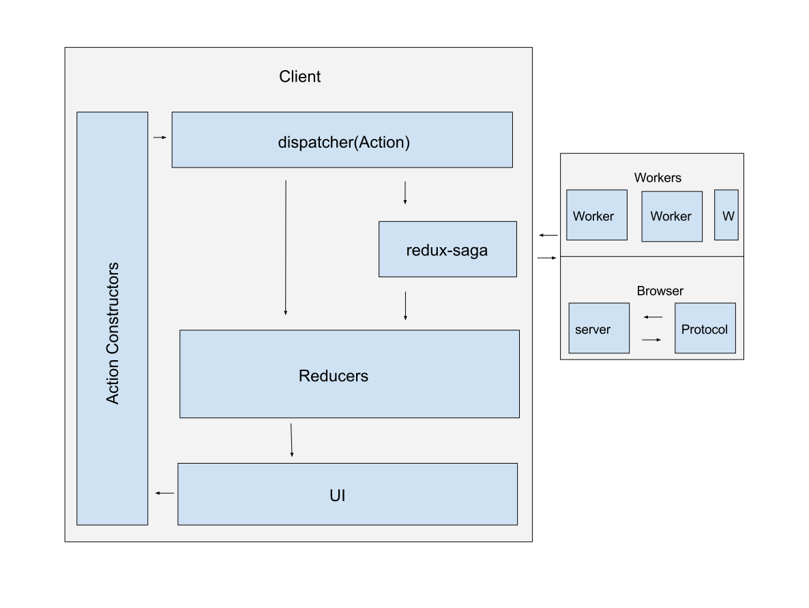

# Side-Effects
### Results may vary

Yulia Startsev

@ioctapteb

---

<!-- .slide: data-background="./images/debugger.png" -->

---

## Help frustrated programmers

1. become more frustrated
2. solve problems

---

## Debugging, what is it really?


---

## Slide

[debugger-debuggee-relationship]

---

## Tasks of a debugger

```c++
main:
00000: getarg 0
00003: dup
00004: callprop "a"
00009: swap
00010: call-ignores-rv
00013: pop
00014: retrval

Source notes:
 ofs line    pc  delta desc     args
---- ---- ----- ------ -------- ------
  0:    3     0 [   0] colspan 13
  2:    3    14 [  14] xdelta
  3:    3    14 [   0] colspan 7
```

---

## Tasks of a debugger

* is informed where the interpreter is in the execution, as the program is running
* is capable of pausing the program
* knows what has happened before this point (callstack)
* allows the user to select pause points

---

## Breakpoints


* are a user interface for choosing where to stop
* are persisted between runs
* UI is crucial

---

## New debugger client

* written in javascript / html (web tech stack)
* using react / redux

---

### Flux



---

## Flux data principles

* central store
* store is updated via actions and reducers
* actions should send "what happened"
* reducers should combine the existing state with the new data

---

## Debugger Event triggers

* server (debuggee events such as exceptions and debugger statements, breakpoints, load events etc)
* user (onclick events, navigation, etc)

---

## async services

* server
* workers (sourceMaps, abstract syntax tree, parser, etc)

---



---

## Two strategies

---



---



---

## Thunks in depth

* compiler theory -- comes from "to have already thought"
* Promise based
* wraps the dispatcher

---

## understanding promises

* promises are a web api
* promises are called after the current callstack clears
* has three states: pending, done, and error

---

```javascript
function basicAction() {
  return ({ dispatch }) => {
    dispatch({ type: "BASIC_ACTION", message: "hi" });
}
```

```javascript
async function basicPromise(arg) {
  const message = await asyncOperation; // { message: `hi ${user}` }
  return message;
}
```

```javascript
function update(state, action) {
  switch (action.type) {
    case "BASIC_ACTION":
      if (action.status === "start") {
        return { message: action.message }; // { status: "done", message: "hi" }
      }
      if (action.status === "done") {
        return { message: action.value.message }; // { status: "done", message: "hi", value: { message: "hi user" } }
      }
      return state;
    default:
      return state;
  }
}
```

---

## Sagas in depth

* comes from the database community -- long life transactions
* each step has potential to roll back or roll forward
* generator based
* listens to actions, and dispatches it's own actions when it is ready

---

## understanding generators

* generators are the underlying logic behind async-await
* generators create an object with a next() method
* `yield` keyword is used to express a "pause" before the `next()` call
* the saga middle ware takes care of calling .next() when an async call is completed

---

```javascript
function* beuysGenerator() {
  yield "ja ja ja";
  yield "ne ne ne";
}

const jaNein = beuysGenerator();

jaNein.next() // { value: "ja ja ja", done: false }
jaNein.next() // { value: "ne ne ne", done: false }
jaNein.next() // { value: undefined, done: true }
```

---

## saga yield functions

#### blocking

```
take
take.maybe
put.resolve
call
all
join
cancel
actionChannel
```

#### non-blocking

```
takeEvery
put
fork
spawn
```


---

## basic saga examples

```javascript
function basicAction() {
  return ({ dispatch }) => {
    dispatch({ type: "BASIC_ACTION", message: "hi" });
}
```

```javascript
function* watchBasicAction() {
  yield takeEvery('BASIC_ACTION', basicSaga)
}

function* basicSaga(args) {
  const message = yield call(asyncOperation, args); // { message: `hi ${user}` }
  yield put({ "SUCCESSFUL_ACTION", message });
}
```

---

### comparison
```javascript
async function basicPromise(arg) {
  const message = await asyncOperation; // { message: `hi ${user}` }
  return message;
}
```

---

### reducer

```javascript
function update(state, action) {
  switch (action.type) {
    case "BASIC_ACTION":
      return { message: action.message }; // { status: "done", message: "hi" }

    case "SUCCESSFUL_ACTION":
      return { message: action.message }; // { status: "done", message: "hi user" }

    default:
      return state;
  }
}
```

---

### comparison
```javascript
function update(state, action) {
  switch (action.type) {
    case "BASIC_ACTION":
      if (action.status === "start") {
        return { message: action.message }; // { status: "done", message: "hi" }
      }
      if (action.status === "done") {
        return { message: action.value.message }; // { status: "done", message: "hi", value: { message: "hi user" } }
      }
      return state;
    default:
      return state;
  }
}
```


---

## Taking this into the debugger: New Source

Loading a new source

* one main task
* three secondary tasks that may or may not take effect

---

```
server
|-> new source
   |-> dispatch "ADD_SOURCE"
   |-> maybe add source map
   |   |-> load sourceMap
   |   |-> add original sources
   |-> maybe select source
   |   |-> load Source Text
   |   |-> re-evaluate breakpoints
   |   |-> dispatch addBreakpoints
   |-> maybe add breakpoints
       |-> load Source Text
       |-> dispatch selectSource
```

---

## thunk: new source

```javascript
function newSource(source) {
  return async ({ dispatch, getState }) => {
    dispatch({ type: "ADD_SOURCE", source });
    dispatch(loadSourceMap(source)); // an async operation
    await selectedSource(getState(), dispatch, source);
    await checkBreakpoints(getState(), dispatch, source);
  };
}
```

---

## saga: new source

```javascript
function* watchNewSource() {
  yield takeEvery('NEW_SOURCE', newSource)
}

function* newSource(source) {
  yield put({ type: "ADD_SOURCE", source });
  yield spawn(loadSourceMap, source));
  yield spawn(selectSource, source));
  yield spawn(checkBreakpoints, source));
}
```

---

## thunk loadSourceMap
```javascript
function* loadSourceMap(source) {
  return async ({ dispatch }) => {
    if (hasSourceMap(source)) {
      const data = await sourceMaps.loadSourceMap(source);
      dispatch({ type: "LOAD_SOURCE_MAP", source, ...data });
    }
  };
}
```

---

## saga: loadSourceMap

```javascript
function* loadSourceMap(source) {
  if (hasSourceMap(source)) {
    const data = yield call(loadSourceMap, source);
    yield put({ type: "LOAD_SOURCE_MAP", source, ...data });
  }
}
```

---

## thunk: selectSource
```javascript
function selectSource(sourceId}) {
  return ({ dispatch, getState }) => {
    const source = getSource(getState(), id);

    if (source.isSelected) {
      dispatch(loadSourceText(source));
      return dispatch({ type: "SELECT_SOURCE", sourceId });
    }
  };
}
```

---

## saga: selectSource

```javascript
function* selectSource(sourceId,) {
  const source = yield select(getSource, sourceId);

  if (source.isSelected) {
    yield put({ type: "LOAD_SOURCE_TEXT", source });
    yield put({ type: "SELECT_SOURCE", sourceId });
  }
}
```

---

## thunk: checkBreakpoint
```javascript
async function checkBreakpoints(state, dispatch, source) {
  const breakpoints = getBreakpointsForSource(state, source.url);
  if (breakpoints.length) {
    await dispatch(loadSourceText(source));
    const breakpointsData = await Promise.all(
      breakpoints.reduce(checkBreakpointLocation, [])
    )
    dispatch(syncBreakpoints(source, breakpointsData);
  }
}
```

---

## saga: checkBreakpoint

```javascript
function* checkBreakpoints(source) {
  const breakpoints = yield select(getBreakpointsForSource, source.url);
  if (breakpoints.length) {
    yield put.resolve({ type: "LOAD_SOURCE_TEXT", source });
    const breakpointsData = yield all(
      breakpoints.reduce(checkBreakpointLocation, [])
    )

    yield put({ type: "SYNC_BREAKPOINTS", breakpointsData, source });
  }
}
```

---

## Load source text
* is used in two places
* is costly

---

```javascript
function selectSource(sourceId}) {
  return ({ dispatch, getState }) => {
    // ...
    if (source.isSelected) {
      await dispatch(loadSourceText(source));
      // ...
    }
  };
}
```

```javascript
async function checkBreakpoints(state, dispatch, source) {
  // ...
  if (breakpoints.length) {
    await dispatch(loadSourceText(source));
    // ...
  }
}
```

---

```javascript
function newSource(source) {
  return async ({ dispatch, getState }) => {
    // ...
    await checkSelectedSource(getState(), dispatch, source);
    await checkPendingBreakpoints(getState(), dispatch, source);
  };
}
```

---

## Thunk Load source text

```javascript
function loadSourceText(source) {
  return async ({ dispatch }) => {
    if (source.text) {
      return Promise.resolve(source);
    }

    await dispatch({
      type: "LOAD_SOURCE_TEXT",
      source: source,
      [PROMISE]: loadSourceTextContents(source)
    });

    await dispatch(setSymbols(source.id));
    await dispatch(setEmptyLines(source.id));
  };
}
```

---

## saga load source text

```javascript
// thunk
await dispatch(loadSourceText(source));

// saga
yield put({ type: "LOAD_SOURCE_TEXT", source });
yield put.resolve({ type: "LOAD_SOURCE_TEXT", source });
```

---

## saga channels
```javascript
yield takeEvery('BASIC_ACTION', basicSaga)

// vs

const requestChan = yield actionChannel('LOAD_SOURCE_TEXT')
```

---

```javascript
function* watchLoadSourceText() {
  const requestChan = yield actionChannel('LOAD_SOURCE_TEXT')
  while (true) {
    const { payload: { source } } = yield take(requestChan)
    if (source.text) {
      yield source;
    } else {
      yield call(loadSourceText, source)
    }
  }
}
```

```javascript
function* loadSourceText(source) {
  const data = yield call(loadSourceTextContents, source);
  yield put.resolve({ type: "SOURCE_TEXT_AVAILABLE", source, ...data });
  yield call(setSymbols, source.id);
  yield call(setEmptyLines, source.id);
}
```

---

## Observations

* much of the code is the same
* sagas become truely useful when you have complex scheduling
* thunks are useful for simple applications that do not need this amount of control
* sagas are more declaritive than thunks; you will need to comment less
* sagas have a learning curve, meaning any new contributor to your project will have a period of
  time to ramp up

---

## Doing more with sagas
```javascript
function* watchLoadSourceText() {
  const requestChan = yield actionChannel('LOAD_SOURCE_TEXT')
  while (true) {
    const { payload: { source } } = yield take(requestChan)
    if (source.text) {
      yield source;
    } else {
      // lets do something else here...
    }
  }
}
```

---

### roll forward on an error
```javascript
// retry and error handling
function* loadSourceTextRepeat(source) {
  for(let i = 0; i < 5; i++) {
    try {
      yield call(loadSourceText, source)
    } catch (err) {
      yield call(delay, 1000); // try again in a bit
    }
  }
  yield put({ type: "LOAD_TEXT_ERROR", source });
}
```

---

### do something else entirely
```javascript
// retry and error handling
function* streamSource(source) {
  try {
    yield call(loadSourceText, source)
  } catch (err) {
    yield put({ type: "DELETE_SOURCE", source }); //re-enter the queue at the end
  }
}
```

---

### thunk reducer
```javascript
function update(state, action) {
  switch (action.type) {
    case "LOAD_SOURCE_TEXT":
      if (status === "error") {
        // ... we would have to handle rollback here
      }
      return state;

    default:
      return state;
  }
}
```

---

### saga reducers
```javascript
function update(state, action) {
  switch (action.type) {
    case "LOAD_SOURCE_TEXT":
      // ...

    case "SOURCE_TEXT_AVAILABLE":
      // ...

    case "SOURCE_ERROR":
      // ...

    case "DELETE_SOURCE":
      // ...

    case "RESET_TO_LOADING":
      // ...

    default:
      return state;
  }
}
```

---

## Side effects: what do you need

* are you waiting for sources to load before displaying something? Thunks; something that is
  in-process, a part of the action or process that is already on going.

* are you sheduling complex interactions between different services? Sagas; something that listens
  to actions, is its own service and acts when appropriate

---

## Thank you!

http://github.com/devtools-html

@ioctaptceb
